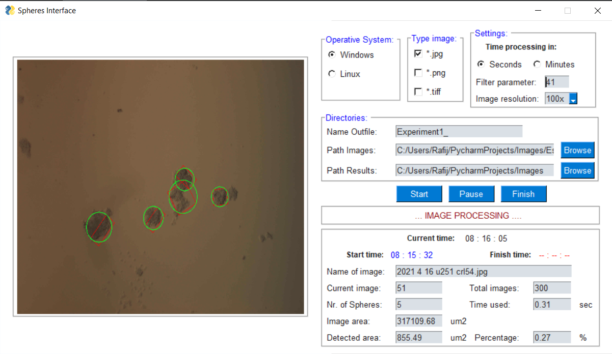

# Spheres Interface
**Spheres Interface** is a GUI Interface programmed in *PYTHON* using PySimpleGUI to detect regions with cells in a sequence of images.
* When a cell has been detected, the algorithm computes the region area in micrometers according to the image's resolution.
* The region area is computed using contours detection.
* Results are presented in the CSV file, once the analysis has finished.

This is a test version 0.2.3

